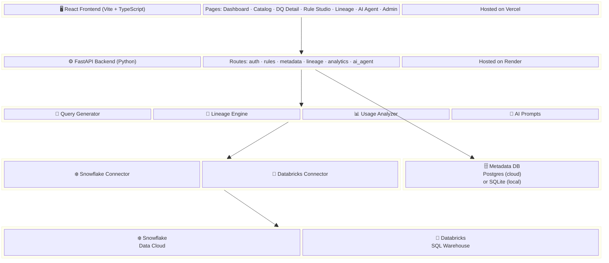

# ValiData — Project Overview

## What is ValiData?

ValiData is a **Data Quality & Observability platform** for **Snowflake** and **Databricks** warehouses.
It lets teams define quality rules, profile columns, track anomalies, explore lineage, and chat with an AI agent — all without extracting data out of the warehouse.

**Core principle → Pushdown Architecture:** ValiData generates SQL, pushes it into the warehouse, and only retrieves scores/counts back. Raw data never leaves the warehouse.

---

## Block Diagram

---

## How It Works (5 Steps)

1. **User logs in** → credentials stored in browser, warehouse creds entered in Connection Vault
2. **User browses** → frontend calls backend → backend generates SQL (via `QueryGenerator`) → SQL runs inside Snowflake/Databricks → metadata comes back
3. **User defines rules** → e.g. "Column X must not be NULL" → rule saved in Metadata DB
4. **User executes rules** → backend pushes DQ SQL into warehouse → gets `{total_rows, failed_rows}` → computes DQ score → logs result + creates anomaly if failed
5. **User schedules** → backend runs rules on a timer (background thread) → stores results automatically

---

## What's Stored Where

| Store | What lives there |
|---|---|
| **Snowflake / Databricks** | All actual data — ValiData only reads it via SQL, never copies it |
| **Metadata DB** (Postgres or SQLite) | Users, rules, rule executions, anomalies, DQ scores, schedules, column profiles, audit logs |
| **Browser localStorage** | Auth token, warehouse credentials, selected platform/role |

---

## Tech Stack at a Glance

| | Technology |
|---|---|
| **Frontend** | React 19 · TypeScript · Vite 8 · React Flow (lineage graphs) · Lucide (icons) |
| **Backend** | FastAPI · Python · Uvicorn |
| **Connectors** | `snowflake-connector-python` · `databricks-sql-connector` |
| **AI** | Snowflake Cortex (Mistral-large) · Databricks AI Functions (Llama 3) — runs inside the warehouse |
| **Metadata DB** | PostgreSQL (Neon, cloud) or SQLite (local dev) |
| **Deploy** | Vercel (frontend) · Render (backend) · Neon (DB) |
