# ValiData (Project Robin) AI Diagram Generation Prompt Guide

This file contains copy-pasteable prompts and text-to-diagram specifications that you can supply to AI diagram generation tools (like Eraser.io, Claude, ChatGPT, Whimsical, or Mermaid Live) to create a detailed, production-ready component interaction diagram.

---

## 1. Natural Language Prompt for Visual AI Diagram Tools
*Copy and paste the prompt below into the AI builder of your diagram application (e.g. Eraser.io, Whimsical, Lucidchart, Miro AI, or Claude/ChatGPT):*

```text
Create a highly detailed, professional-grade component architecture and interaction diagram for "ValiData" (also known as Project Robin), an enterprise-grade data quality, cataloging, and lineage control plane.

Organize the components into six horizontal/stacked layers:
1. Presentation Layer (React 19 Frontend SPA)
2. Application Layer (FastAPI Backend Core Services)
3. Processing & Intelligence Layer (Analytics & Execution Engines)
4. Integration Layer (Database Connectors & Pools)
5. Data & Storage Layer (Internal SQLite/PostgreSQL Database & Local Session Storage)
6. External Systems (Target Enterprise Data Warehouses)

Define the specific components inside each layer as follows:
- Presentation Layer:
  * "LoginPage" (Platform selection & connection vault)
  * "TopBar Dropdown" (Dynamic connection details, active role displaying, and dynamic role selector with warning indicator)
  * "Dashboard UI" (Rule execution results, metrics, failure counts, anomaly charts)
  * "Rule Studio UI" (Rule builder & scheduling configs)
  * "Data Catalog UI" (Schema browser, column profiling grids, frequent values list)
  * "Lineage Studio" (Interactive React Flow DAG)
  * "AI Agent Interface" (Natural language chat interface)

- Application Layer:
  * "API Gateway / Route Router"
  * "Authentication & User Service" (User register/login, admin approval workflow)
  * "Session & Context Manager" (Reads temporary keys from secure request headers)
  * "Role Resolver" (Validates active role context and fetches assigned roles list)

- Processing & Intelligence Layer:
  * "SQL Query Generator" (Creates pushdown validation statements for range, null, unique, regex checks)
  * "Rule Execution Engine" (Orchestrates queries, captures row counts, logs telemetry)
  * "Scheduler Daemon" (Manages background cron jobs for recurring rule evaluations)
  * "Profiling Engine" (Extracts Min, Max, Average, Nulls, and Top 3 frequent values)
  * "Lineage Extraction Engine" (Parses warehouse query history log to build dependency graphs)
  * "AI Agent Engine" (Synthesizes warehouse metadata and results to answer chat queries)

- Integration Layer:
  * "Snowflake Connector" (Manages connection pooling via snowflake-connector-python)
  * "Databricks Connector" (Interfaces via databricks-sql-connector)

- Data & Storage Layer:
  * "Metadata Repository (SQLite/PostgreSQL)" (Stores internal state: Users table with signup status, Rules registry, Schedules, Execution Logs, and Anomalies)
  * "Client-Side LocalStorage" (Saves encrypted credentials locally in the browser; only sent in header payload per request, never stored in backend DB)

- External Systems:
  * "Snowflake Data Cloud" (Runs queries using active Snowflake roles and falling back to account level commands like SHOW ROLES/INFORMATION_SCHEMA)
  * "Databricks SQL Workspace" (Executes queries against Delta tables using Unity Catalog schemas)

Map and draw labeled arrows representing the following critical interactions:
1. Connect & Validate Flow: LoginPage -> API Gateway -> Role Resolver -> Snowflake Connector -> Snowflake Data Cloud. Show live roles returned to the LoginPage. If the active role matches the Snowflake console, the TopBar Dropdown shows positive validation; if not, show warning state.
2. User Signup & Approval Flow: LoginPage (Signup) -> User Service -> Metadata Repository (User table, status = PENDING). Admin User -> User Service -> updates status to APPROVED.
3. Rule Authoring & Execution: Rule Studio UI -> SQL Query Generator -> Rule Execution Engine -> Connectors -> Data Warehouses (Pushdown execution - data does not leave the warehouse).
4. Results Logs & Alerts: Rule Execution Engine -> writes results to Metadata Repository -> updates Dashboard UI.
5. Live Column Profiling: Data Catalog UI -> Profiling Engine -> Connectors -> Data Warehouses (Calculates Min/Max/Avg/Top-3). Profiles are saved in Metadata Repository and displayed on the Data Catalog UI.
6. Lineage Graph Rendering: Lineage Studio -> Lineage Extraction Engine -> Snowflake/Databricks Connectors -> Queries query execution history -> returns dependency nodes/edges -> displays on React Flow canvas.
7. AI Agent Chat: AI Agent Interface -> AI Agent Engine -> queries Metadata Repository -> returns natural language insights and generated SQL.

Design Requirements:
- Theme: Premium, modern dark-mode appearance (slate gray and deep navy blue palettes).
- Shapes: Rounded boxes for services/UI components, cylinder shapes for database storage layers, and cloud symbols for external warehouses.
- Connections: Clear, single-color line arrows for flow directions. Use dashed lines for asynchronous callback/fetch events.
- Output: Render a symmetrical, highly detailed, easily readable layout.
```

---

## 2. Text-to-Diagram: Compliant Mermaid.js Code
*Use this in any Mermaid-compliant renderer (e.g. GitHub markdown, Notion, Mermaid Live Editor):*

```mermaid
flowchart TB
    %% ==========================================
    %% PRESENTATION LAYER (FRONTEND)
    %% ==========================================
    subgraph PresentationLayer["A. Presentation Layer (React 19 Frontend SPA)"]
        UI_Login["LoginPage & Connection Vault"]
        UI_TopBar["TopBar Dropdown (Active Role & Validations)"]
        UI_Dashboard["Dashboard UI (Telemetry & KPI Panels)"]
        UI_Rules["Rule Studio UI (Rule Authoring)"]
        UI_Catalog["Data Catalog UI (Schema & Profiling Explorer)"]
        UI_Lineage["Lineage Studio (React Flow DAG Visualizer)"]
        UI_AI["AI Agent Interface (Chat Bubble UI)"]
    end
    style PresentationLayer fill:#111827,stroke:#374151,stroke-width:2px,color:#fff

    %% ==========================================
    %% APPLICATION LAYER (CORE SERVICES)
    %% ==========================================
    subgraph ApplicationLayer["B. Application Layer (FastAPI Backend Core Services)"]
        APIGateway["API Gateway Router"]
        AuthSvc["Authentication & User Service"]
        SessionMgr["Session & Context Manager"]
        RoleResolver["Role Resolver (Live Role Checker)"]
    end
    style ApplicationLayer fill:#1f2937,stroke:#4b5563,stroke-width:2px,color:#fff

    %% ==========================================
    %% PROCESSING & INTELLIGENCE LAYER
    %% ==========================================
    subgraph ProcessingLayer["C. Processing and Intelligence Layer"]
        QueryGen["SQL Query Generator"]
        ExecEngine["Rule Execution Engine"]
        SchedEngine["Scheduler Daemon (Cron Task Thread)"]
        ProfileEngine["Profiling Engine (Stats & Top 3)"]
        LineageEngine["Lineage Extraction Engine (Log Analyzer)"]
        AIEngine["AI Agent Engine (Cortex/LLM synthesis)"]
    end
    style ProcessingLayer fill:#111827,stroke:#374151,stroke-width:2px,color:#fff

    %% ==========================================
    %% INTEGRATION LAYER (CONNECTORS)
    %% ==========================================
    subgraph IntegrationLayer["D. Integration Layer"]
        SF_Conn["Snowflake Connector (DictCursor)"]
        DB_Conn["Databricks Connector"]
    end
    style IntegrationLayer fill:#1f2937,stroke:#4b5563,stroke-width:2px,color:#fff

    %% ==========================================
    %% DATA & STORAGE LAYER
    %% ==========================================
    subgraph StorageLayer["E. Data and Storage Layer"]
        DB_Meta[(Metadata Repository: SQLite / Neon Postgres)]
        Client_Storage[(Client-Side LocalStorage: Encrypted Credentials)]
    end
    style StorageLayer fill:#1e1b4b,stroke:#4f46e5,stroke-width:2px,color:#fff

    %% ==========================================
    %% EXTERNAL SYSTEMS
    %% ==========================================
    subgraph ExternalSystems["F. External Systems (Client Warehouses)"]
        SF_Warehouse[(Snowflake Data Cloud)]
        DB_Workspace[(Databricks SQL Workspace)]
    end
    style ExternalSystems fill:#0c4a6e,stroke:#0284c7,stroke-width:2px,color:#fff

    %% ==========================================
    %% CRITICAL INTERACTIONS & FLOW LINES
    %% ==========================================
    
    %% 1. Connection Vault & Role Resolver
    UI_Login -->|"1a. Connect Request"| APIGateway
    APIGateway -->|"1b. Validate Credentials"| RoleResolver
    RoleResolver -->|"1c. Query live roles"| SF_Conn
    SF_Conn -->|"1d. SHOW ROLES / GRANTS"| SF_Warehouse
    SF_Warehouse -->>|"1e. Active & Available Roles"| SF_Conn
    SF_Conn -->>|"1f. Active Role validation status"| RoleResolver
    RoleResolver -->>|"1g. Return verification payload"| UI_Login
    UI_Login -->|"1h. Save encrypted pass locally"| Client_Storage

    %% 2. User Authentication and Approvals
    UI_Login -->|"2a. User Signup"| AuthSvc
    AuthSvc -->|"2b. Insert (PENDING status)"| DB_Meta
    AuthSvc -->>|"2c. Display Pending Message"| UI_Login

    %% 3. TopBar Role Dropdown Logic
    UI_TopBar -.->|"3a. Read current credentials context"| Client_Storage
    UI_TopBar -->|"3b. Dynamic role fetch & status check"| RoleResolver
    RoleResolver -->>|"3c. Dynamic warning state on mismatch"| UI_TopBar

    %% 4. Rule Authoring & SQL Execution (Zero-Data Movement)
    UI_Rules -->|"4a. Define Data Quality checks"| QueryGen
    QueryGen -->|"4b. Generate pushdown SQL query"| ExecEngine
    ExecEngine -.->|"4c. Inject password from client header"| Client_Storage
    ExecEngine -->|"4d. Dispatch query"| SF_Conn
    ExecEngine -->|"4d. Dispatch query"| DB_Conn
    SF_Conn -->|"4e. Execute in warehouse"| SF_Warehouse
    DB_Conn -->|"4e. Execute in workspace"| DB_Workspace
    SF_Warehouse -->>|"4f. Return counts & results only"| SF_Conn
    DB_Workspace -->>|"4f. Return counts & results only"| DB_Conn
    SF_Conn -->>|"4g. Metrics payload"| ExecEngine
    DB_Conn -->>|"4g. Metrics payload"| ExecEngine
    ExecEngine -->|"4h. Write run details & anomalies log"| DB_Meta
    DB_Meta -.->|"4i. Render status panels"| UI_Dashboard

    %% 5. Data Catalog Profiling (Min/Max/Avg & Top 3)
    UI_Catalog -->|"5a. Request Profile & Evaluate"| ProfileEngine
    ProfileEngine -->|"5b. Query statistics & samples"| SF_Conn
    ProfileEngine -->|"5b. Query statistics & samples"| DB_Conn
    SF_Conn -->|"5c. Pushdown profile aggregates"| SF_Warehouse
    DB_Conn -->|"5c. Pushdown profile aggregates"| DB_Workspace
    SF_Warehouse -->>|"5d. Return stats"| SF_Conn
    DB_Workspace -->>|"5d. Return stats"| DB_Conn
    SF_Conn -->>|"5e. Profiling payload"| ProfileEngine
    DB_Conn -->>|"5e. Profiling payload"| ProfileEngine
    ProfileEngine -->|"5f. Save columns overview & freq values"| DB_Meta
    DB_Meta -.->|"5g. Populate explore grids"| UI_Catalog

    %% 6. Lineage Graph Extraction
    UI_Lineage -->|"6a. Query table lineages"| LineageEngine
    LineageEngine -->|"6b. Read metadata logs"| SF_Conn
    SF_Conn -->|"6c. Fetch query history & system logs"| SF_Warehouse
    SF_Warehouse -->>|"6d. Ingest executed SQL text"| SF_Conn
    SF_Conn -->>|"6e. Parse SQL statements"| LineageEngine
    LineageEngine -->|"6f. Save mapped node-edge relationships"| DB_Meta
    DB_Meta -.->|"6g. Render interactive DAG"| UI_Lineage

    %% 7. AI Agent Execution
    UI_AI -->|"7a. Enter natural language question"| AIEngine
    AIEngine -->|"7b. Search metadata catalog context"| DB_Meta
    AIEngine -->|"7c. Generate and check warehouse queries"| SF_Conn
    SF_Conn -->|"7d. Execute safe metadata check"| SF_Warehouse
    SF_Warehouse -->>|"7e. Results payload"| SF_Conn
    SF_Conn -->>|"7f. Formulate answer text"| AIEngine
    AIEngine -->>|"7g. Stream chat response"| UI_AI
```

---

## 3. Text-to-Diagram: PlantUML Specification
*Use this code block in any PlantUML editor (such as PlantText or a local IDE plugin):*

```plantuml
@startuml
skinparam BackgroundColor #111827
skinparam ArrowColor #4f46e5
skinparam ActorBorderColor #374151
skinparam PackageBackgroundColor #1f2937
skinparam PackageBorderColor #4b5563
skinparam PackageFontColor #ffffff

skinparam Component {
  BackgroundColor #374151
  BorderColor #4b5563
  FontColor #ffffff
  ArrowColor #4f46e5
}

skinparam Database {
  BackgroundColor #1e1b4b
  BorderColor #4f46e5
  FontColor #ffffff
}

package "A. Presentation Layer (React SPA)" {
  [LoginPage & Vault] as UI_Login
  [TopBar Dropdown] as UI_TopBar
  [Dashboard UI] as UI_Dashboard
  [Rule Studio UI] as UI_Rules
  [Data Catalog UI] as UI_Catalog
  [Lineage Studio] as UI_Lineage
  [AI Agent UI] as UI_AI
}

package "B. Application Layer (FastAPI Backend)" {
  [API Gateway] as APIGateway
  [Auth & User Service] as AuthSvc
  [Session Manager] as SessionMgr
  [Role Resolver] as RoleResolver
}

package "C. Processing & Intelligence Layer" {
  [SQL Query Generator] as QueryGen
  [Rule Execution Engine] as ExecEngine
  [Scheduler Daemon] as SchedEngine
  [Profiling Engine] as ProfileEngine
  [Lineage Extraction Engine] as LineageEngine
  [AI Agent Engine] as AIEngine
}

package "D. Integration Layer" {
  [Snowflake Connector] as SF_Conn
  [Databricks Connector] as DB_Conn
}

database "E. Data & Storage Layer" {
  [Metadata Database] as DB_Meta
  [Browser LocalStorage] as Client_Storage
}

cloud "F. External Cloud Warehouses" {
  [Snowflake Data Cloud] as SF_Warehouse
  [Databricks SQL Workspace] as DB_Workspace
}

' Interactions
UI_Login --> APIGateway : "1. Test Credentials"
APIGateway --> RoleResolver : "2. Fetch & Resolve Roles"
RoleResolver --> SF_Conn : "3. Query Warehouse"
SF_Conn --> SF_Warehouse : "4. SHOW ROLES"
SF_Warehouse --> SF_Conn : "5. Return assigned roles"
SF_Conn --> RoleResolver : "6. Return roles & check status"
RoleResolver --> UI_Login : "7. Return validated roles"
UI_Login --> Client_Storage : "8. Encrypt & Save password locally"

UI_TopBar ..> Client_Storage : "Read Session context"
UI_TopBar --> RoleResolver : "Trigger active role validation"

UI_Rules --> QueryGen : "1. Define rules"
QueryGen --> ExecEngine : "2. Compile pushdown SQL"
ExecEngine ..> Client_Storage : "Retrieve connection password"
ExecEngine --> SF_Conn : "3. Send check query"
ExecEngine --> DB_Conn : "3. Send check query"
SF_Conn --> SF_Warehouse : "4. Pushdown query execution"
DB_Conn --> DB_Workspace : "4. Pushdown query execution"
SF_Warehouse --> SF_Conn : "5. Return pass/fail count records"
DB_Workspace --> DB_Conn : "5. Return pass/fail count records"
SF_Conn --> ExecEngine : "6. Parse results metrics"
DB_Conn --> ExecEngine : "6. Parse results metrics"
ExecEngine --> DB_Meta : "7. Write run details & logs"
DB_Meta ..> UI_Dashboard : "Refresh dashboard panels"

UI_Catalog --> ProfileEngine : "1. Profile & Evaluate"
ProfileEngine --> SF_Conn : "2. Push down Profile calculations"
SF_Conn --> SF_Warehouse : "3. Compute Stats (Min, Max, Avg, Top-3)"
SF_Warehouse --> SF_Conn : "4. Return results"
SF_Conn --> ProfileEngine : "5. Format details"
ProfileEngine --> DB_Meta : "6. Store profiles table"
DB_Meta ..> UI_Catalog : "Refresh profile grids"

UI_Lineage --> LineageEngine : "1. Fetch relations graph"
LineageEngine --> SF_Conn : "2. Ingest query histories"
SF_Conn --> SF_Warehouse : "3. Retrieve account query history logs"
SF_Warehouse --> SF_Conn : "4. Return sql string logs"
SF_Conn --> LineageEngine : "5. Parse lineage DAG"
LineageEngine --> DB_Meta : "6. Save nodes & edges mapping"
DB_Meta ..> UI_Lineage : "Render React Flow DAG"

UI_AI --> AIEngine : "1. Chat query"
AIEngine --> DB_Meta : "2. Lookup Schema definitions"
AIEngine --> SF_Conn : "3. Generate & Verify context"
AIEngine --> UI_AI : "4. Stream response message"

@enduml
```


