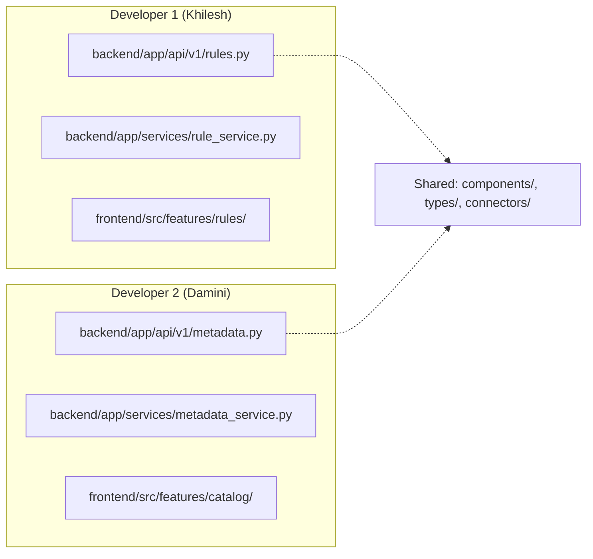
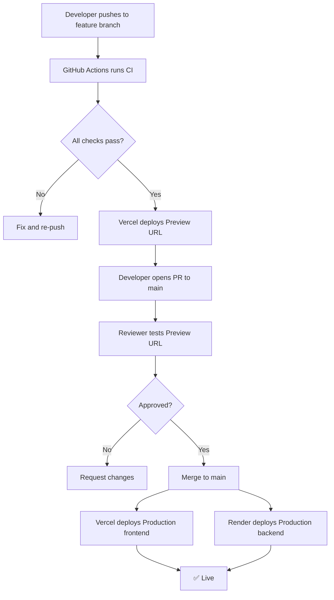

# 🏢 ValiData (Robin) — Enterprise-Grade Architecture Guide

A comprehensive blueprint for a production-hardened, multi-developer enterprise application.

---

## Table of Contents

1. [Feature-Driven Platform Architecture](#1-feature-driven-platform-architecture)
2. [Recommended Folder Structure](#2-recommended-folder-structure)
3. [Purpose of Each Folder](#3-purpose-of-each-folder--detailed-breakdown)
4. [Multi-Developer Scaling Best Practices](#4-multi-developer-scaling-best-practices)
5. [Integrating New Features Without Breaking Existing Code](#5-integrating-new-features-without-breaking-existing-code)
6. [CI/CD & Deployment Readiness](#6-cicd--deployment-readiness)
7. [Documentation & Version Control](#7-documentation--version-control)
8. [Migration Roadmap](#8-migration-roadmap--phased-execution-plan)

---

## 1. Feature-Driven Platform Architecture

To support scaling to multiple developers, ValiData adopts a **Hexagonal & Feature-Driven Architecture** for the backend. 
This strictly isolates platform-specific logic (Snowflake vs Databricks) from the core business logic (Features), ensuring zero merge conflicts and high scalability.

### The Core Principle: Vertical Slices & Adapters

```
backend/app/
├── platforms/
│   ├── snowflake/      (Platform-specific adapters & configs)
│   └── databricks/     (Platform-specific adapters & configs)
└── shared_resources/
    ├── features/       (Vertical slices: rule_studio, dashboard, etc.)
    ├── database/       (Internal state DB config: Postgres/SQLite)
    └── core/           (Shared engines)
```

### Detailed Endpoint-to-Feature Mapping

The backend routes are decomposed into 10 distinct feature folders inside `shared_resources/features/`:

| Feature Folder | Purpose & Endpoints Included |
|:---------------|:-----------------------------|
| `auth/` | **Login & Registration**: `/login`, `/register`, `/forgot-password`, `/reset-password` |
| `user_management/` | **Admin Panel**: `/admin/users`, approve/reject users, toggle admin access |
| `connections/` | **Warehouse Vault**: `/test-connection`, `/fetch-roles`, `/fetch-warehouses`, `/update_credentials` |
| `rule_studio/` | **Rule Management**: Rule CRUD, execution, sync, cron scheduling calculation, job runner |
| `dashboard/` | **Executive Dashboard**: `/dashboard/metrics`, active anomalies, run history, latest executions |
| `data_catalog/` | **Metadata**: Fetch tables, column profiling, data preview |
| `lineage/` | **Lineage Discovery**: Infer relationships and build graphs |
| `analytics/` | **Usage Analytics**: Platform usage stats, warehouse analytics |
| `query_history/` | **Query Logs**: Fetch Snowflake/Databricks query logs |
| `ai_agent/` | **AI Assistant**: Snowflake Cortex / AI suggestions |

### Why This is the Expert Choice
1. **Zero Merge Conflicts**: Dev 1 builds in `rule_studio/`, Dev 2 builds in `data_catalog/`. They never touch the same files.
2. **Platform Isolation**: Databricks-specific query logic lives strictly in `platforms/databricks/`. It does not bleed into the shared features.
3. **Microservice Ready**: If the AI Agent becomes resource-heavy, you can easily detach `features/ai_agent/` into its own separate microservice because its code is already physically isolated.

### Updated `main.py` Registration

The orchestrator simply includes the router from each feature module:

```python
# main.py 
from app.shared_resources.features.auth.router import router as auth_router
from app.shared_resources.features.dashboard.router import router as dashboard_router
# ... etc

app.include_router(auth_router, prefix="/api/v1/auth", tags=["Auth"])
app.include_router(dashboard_router, prefix="/api/v1/dashboard", tags=["Dashboard"])
```

---

## 2. Recommended Folder Structure

### Hierarchy Diagram

```
ValiData/
│
├── 📁 .github/                          ← GitHub-specific automation
├── 📁 docs/                             ← All project documentation
├── 📁 planning/                         ← Product planning & roadmap
├── 📁 bugs/                             ← Bug tracking & investigation
│
├── 📁 backend/                          ← ★ ALL Python/FastAPI code lives here
│   ├── main.py                          ← App factory + startup
│   ├── requirements.txt                 
│   ├── pyproject.toml                   
│   ├── Dockerfile                       
│   │
│   ├── 📁 app/                          ← Application package
│   │   ├── factory.py                   ← create_app() factory pattern
│   │   │
│   │   ├── 📁 platforms/                ← ★ Platform-Specific Adapters
│   │   │   ├── 📁 snowflake/            
│   │   │   │   ├── config.py            ← Snowflake environment settings
│   │   │   │   ├── connector.py         ← Snowflake engine connection pool
│   │   │   │   └── queries.py           ← Snowflake-specific SQL generation
│   │   │   └── 📁 databricks/           
│   │   │       ├── config.py            
│   │   │       ├── connector.py         
│   │   │       └── queries.py           
│   │   │
│   │   └── 📁 shared_resources/         ← ★ Core Application & Business Logic
│   │       ├── 📁 features/             ← Vertical Slices
│   │       │   ├── 📁 auth/             ← Login, OTP, Resend emails
│   │       │   │   ├── router.py
│   │       │   │   ├── service.py
│   │       │   │   └── schemas.py
│   │       │   ├── 📁 user_management/  ← Admin approval, role toggles
│   │       │   ├── 📁 dashboard/        ← Metrics, anomalies
│   │       │   ├── 📁 ai_agent/         ← AI suggestions, Cortex chat
│   │       │   ├── 📁 data_catalog/     ← Metadata profiling
│   │       │   ├── 📁 connections/      ← Warehouse credential vault
│   │       │   ├── 📁 rule_studio/      ← Rule CRUD, scheduling
│   │       │   ├── 📁 lineage/          ← Dependency inference
│   │       │   ├── 📁 analytics/        ← Usage analytics 
│   │       │   └── 📁 query_history/    ← Query execution logs
│   │       │
│   │       ├── 📁 database/             ← Internal App State (SQLite/Postgres)
│   │       │   ├── connection.py        ← Internal DB connection
│   │       │   ├── init.py              ← Initial schema setup
│   │       │   └── models.py            ← Pydantic/SQLAlchemy models
│   │       │
│   │       ├── 📁 core/                 ← Cross-cutting engines
│   │       │   └── prompts.py           ← Shared AI prompt templates
│   │       │
│   │       ├── 📁 middleware/           ← Request/Response interceptors
│   │       │   ├── auth_middleware.py        
│   │       │   └── error_handler.py         
│   │       │
│   │       ├── 📁 config/               ← Global App Configuration
│   │       │   └── settings.py          ← Pydantic BaseSettings
│   │       │
│   │       └── 📁 utils/                ← Shared utilities
│   │
│   ├── 📁 tests/                        ← ★ ALL backend tests
│   └── 📁 scripts/                      ← Operational scripts
│   │
│   ├── 📁 tests/                        ← ★ ALL backend tests
│   │   ├── conftest.py                  ← Shared pytest fixtures
│   │   ├── pytest.ini                   ← Pytest configuration
│   │   ├── 📁 unit/                     ← Fast, isolated unit tests
│   │   │   ├── test_query_generator.py
│   │   │   ├── test_lineage_engine.py
│   │   │   ├── test_auth_service.py
│   │   │   └── test_rule_service.py
│   │   ├── 📁 integration/             ← Tests with real DB/external services
│   │   │   ├── test_snowflake_connection.py
│   │   │   ├── test_databricks_connection.py
│   │   │   └── test_api_endpoints.py
│   │   └── 📁 fixtures/                ← Test data files
│   │       ├── sample_schema.json
│   │       └── mock_responses.json
│   │
│   └── 📁 scripts/                      ← Operational scripts
│       ├── seed_db.py                   ← Seed database with test data
│       ├── migrate.py                   ← Run database migrations manually
│       └── 📁 sql/                      ← SQL scripts for warehouse setup
│           └── snowflake_dq_setup.sql
│
├── 📁 frontend/                         ← ★ ALL React/TypeScript code
│   ├── package.json
│   ├── tsconfig.json
│   ├── vite.config.ts
│   ├── vercel.json
│   ├── Dockerfile                       ← Frontend container (for non-Vercel deploys)
│   ├── .env.example                     ← Frontend env var template
│   │
│   └── 📁 src/
│       ├── main.tsx                      ← React entry point
│       ├── App.tsx                       ← Root component + routing
│       ├── api.ts                        ← API base URL config
│       │
│       ├── 📁 config/                    ← Frontend configuration
│       │   ├── routes.ts                 ← Route path constants
│       │   ├── constants.ts              ← App-wide constants
│       │   └── env.ts                    ← Environment variable validation
│       │
│       ├── 📁 features/                  ← ★ Feature-based modules
│       │   ├── 📁 auth/                  ← Authentication feature
│       │   │   ├── LoginPage.tsx
│       │   │   ├── LoginPage.css
│       │   │   ├── components/           ← Auth-specific sub-components
│       │   │   │   ├── LoginForm.tsx
│       │   │   │   ├── RegisterForm.tsx
│       │   │   │   └── OTPInput.tsx
│       │   │   ├── hooks/
│       │   │   │   └── useAuth.ts
│       │   │   └── services/
│       │   │       └── authService.ts
│       │   │
│       │   ├── 📁 dashboard/             ← Dashboard feature
│       │   │   ├── Dashboard.tsx
│       │   │   ├── Dashboard.css
│       │   │   └── components/
│       │   │       ├── StatsGrid.tsx
│       │   │       ├── RecentActivity.tsx
│       │   │       └── HealthStatus.tsx
│       │   │
│       │   ├── 📁 catalog/               ← Data Catalog feature
│       │   │   ├── DataCatalog.tsx
│       │   │   ├── DataCatalog.css
│       │   │   ├── TableDetail.tsx
│       │   │   ├── TableDetail.css
│       │   │   └── components/
│       │   │       ├── TableList.tsx
│       │   │       ├── ColumnProfile.tsx
│       │   │       └── MetadataEditor.tsx
│       │   │
│       │   ├── 📁 rules/                 ← Rule Studio feature
│       │   │   ├── RuleStudio.tsx
│       │   │   ├── CreateRule.tsx
│       │   │   ├── RuleDetail.tsx
│       │   │   ├── DataQualityDetail.tsx
│       │   │   └── components/
│       │   │       ├── RuleCard.tsx
│       │   │       ├── RuleExecutionHistory.tsx
│       │   │       └── ScheduleManager.tsx
│       │   │
│       │   ├── 📁 lineage/               ← Lineage Studio feature
│       │   │   ├── LineageStudio.tsx
│       │   │   └── components/
│       │   │       └── CustomTableNode.tsx
│       │   │
│       │   ├── 📁 ai-agent/              ← AI Agent feature
│       │   │   ├── AIAgent.tsx
│       │   │   └── components/
│       │   │       ├── ChatMessage.tsx
│       │   │       └── SuggestedRulesModal.tsx
│       │   │
│       │   ├── 📁 analytics/             ← Usage Analytics feature
│       │   │   ├── UsageAnalytics.tsx
│       │   │   ├── QueryHistory.tsx
│       │   │   └── components/
│       │   │       └── UsageChart.tsx
│       │   │
│       │   ├── 📁 observability/         ← Observability feature
│       │   │   ├── ObservabilityConnections.tsx
│       │   │   ├── ObservabilityConnectionDetail.tsx
│       │   │   ├── ObservabilityAlerts.tsx
│       │   │   └── components/
│       │   │       └── AlertCard.tsx
│       │   │
│       │   ├── 📁 connections/           ← Connection Vault feature
│       │   │   ├── Connections.tsx
│       │   │   └── Connections.css
│       │   │
│       │   └── 📁 admin/                 ← Admin Dashboard feature
│       │       ├── AdminDashboard.tsx
│       │       ├── AdminDashboard.css
│       │       └── components/
│       │           └── UserApprovalTable.tsx
│       │
│       ├── 📁 components/                ← ★ Shared/global UI components
│       │   ├── layout/
│       │   │   ├── TopBar.tsx
│       │   │   ├── TopBar.css
│       │   │   ├── Sidebar.tsx
│       │   │   └── Sidebar.css
│       │   ├── ui/                       ← Reusable primitives
│       │   │   ├── Button.tsx
│       │   │   ├── Modal.tsx
│       │   │   ├── SearchableDropdown.tsx
│       │   │   ├── Spinner.tsx
│       │   │   └── Toast.tsx
│       │   └── guards/
│       │       └── ProtectedRoute.tsx
│       │
│       ├── 📁 hooks/                     ← Shared custom hooks
│       │   ├── useClickOutside.ts
│       │   ├── useDebounce.ts
│       │   └── useLocalStorage.ts
│       │
│       ├── 📁 context/                   ← React Context providers
│       │   ├── PlatformContext.tsx
│       │   └── AuthContext.tsx
│       │
│       ├── 📁 services/                  ← API client layer
│       │   ├── apiClient.ts              ← Axios instance with interceptors
│       │   ├── authApi.ts
│       │   ├── rulesApi.ts
│       │   ├── catalogApi.ts
│       │   └── analyticsApi.ts
│       │
│       ├── 📁 types/                     ← TypeScript type definitions
│       │   ├── api.types.ts              ← API request/response types
│       │   ├── models.types.ts           ← Domain model types
│       │   └── common.types.ts           ← Shared utility types
│       │
│       ├── 📁 utils/                     ← Frontend utility functions
│       │   ├── formatters.ts
│       │   ├── validators.ts
│       │   └── constants.ts
│       │
│       ├── 📁 styles/                    ← Global styles
│       │   ├── index.css                 ← CSS variables, resets
│       │   ├── App.css                   ← App-level layout
│       │   └── themes/
│       │       └── dark.css
│       │
│       └── 📁 assets/                    ← Static assets (images, fonts)
│           └── robin-logo.svg
│
├── 📁 config/                            ← ★ Environment & deployment config
│   ├── 📁 environments/
│   │   ├── .env.development              ← Dev defaults (no secrets)
│   │   ├── .env.staging                  ← Staging config template
│   │   ├── .env.production               ← Production config template
│   │   └── .env.example                  ← Master template for all vars
│   └── 📁 docker/
│       ├── docker-compose.yml            ← Local full-stack development
│       ├── docker-compose.test.yml       ← Test environment
│       └── nginx.conf                    ← Reverse proxy config (if needed)
│
├── 📁 shared/                            ← ★ Shared contracts between FE & BE
│   └── 📁 types/
│       ├── api-contracts.ts              ← Shared API types (source of truth)
│       └── enums.ts                      ← Shared enumerations
│
├── .gitignore
├── .editorconfig                         ← Consistent code style across IDEs
├── README.md                             ← Project overview + quickstart
├── LICENSE
└── Makefile                              ← Developer shortcuts (make test, make lint)
```

---

## 3. Purpose of Each Folder — Detailed Breakdown

### Root Level

| Folder | Purpose | Who Writes Here |
|:-------|:--------|:----------------|
| `.github/` | GitHub automation: CI/CD workflows, issue templates, PR templates, CODEOWNERS | DevOps / Tech Lead |
| `docs/` | All human-readable documentation — architecture, API reference, guides, ADRs | All developers |
| `planning/` | Product roadmap, sprint backlogs, RFCs (Request for Comments) for new features | Product Owner / Tech Lead |
| `bugs/` | Known issues tracker, deep-dive investigation notes, post-incident reports | QA / Any developer |
| `backend/` | **All** Python/FastAPI server code | Backend developers |
| `frontend/` | **All** React/TypeScript client code | Frontend developers |
| `config/` | Environment configs, Docker compose files, deployment blueprints | DevOps / Tech Lead |
| `shared/` | TypeScript type definitions shared between frontend and backend API contracts | Any developer |

### Backend (`backend/app/`)

| Folder | Purpose | Design Pattern |
|:-------|:--------|:---------------|
| `platforms/` | Platform-specific adapters. Contains connection logic, SQL generators, and configurations isolated to either Snowflake or Databricks. | **Adapter Pattern** |
| `shared_resources/features/` | **Vertical slices** containing the router, service logic, and pydantic models for a specific domain (e.g., `dashboard/`, `auth/`). | **Feature-Driven (Vertical Slice)** |
| `shared_resources/database/` | Database connection management, initialization, and table definitions for the *internal* application state (users, rules). | **Repository Pattern** |
| `shared_resources/core/` | Cross-cutting engines and shared prompts used by multiple features. | **Domain Logic** |
| `shared_resources/config/` | Global environment variable loading via Pydantic `BaseSettings`. | **Settings Pattern** |
| `shared_resources/middleware/` | Cross-cutting concerns: authentication, logging, error handling. | **Middleware Chain** |
| `shared_resources/utils/` | Pure utility functions with no side effects. | **Utility Module** |

### Frontend (`frontend/src/`)

| Folder | Purpose | Design Pattern |
|:-------|:--------|:---------------|
| `features/` | **Feature-based modules**. Each feature (auth, catalog, rules) owns its pages, components, hooks, and services. A developer working on "rules" touches only `features/rules/`. | **Feature Slicing** |
| `components/` | **Shared UI components** used across multiple features (TopBar, Sidebar, Button, Modal). | **Component Library** |
| `hooks/` | **Shared custom hooks** used across features (useClickOutside, useDebounce). | **Hook Composition** |
| `context/` | React Context providers for global state (auth, platform). | **Context Pattern** |
| `services/` | API client functions organized by domain. Each service maps to a backend API module. | **API Client Layer** |
| `types/` | TypeScript type definitions — API shapes, domain models, shared types. | **Type Safety** |
| `utils/` | Pure utility functions — formatters, validators, constants. | **Utility Module** |
| `styles/` | Global CSS — variables, resets, themes. Feature-specific CSS stays in feature folders. | **CSS Organization** |

### Documentation (`docs/`)

| Folder | Purpose | When to Update |
|:-------|:--------|:---------------|
| `architecture/` | System design docs, data flow diagrams, infrastructure diagrams | When architecture changes |
| `api/` | Complete API reference with endpoints, parameters, responses | When any endpoint changes |
| `guides/` | Onboarding, contributing rules, deployment steps, troubleshooting | When processes change |
| `decisions/` | Architecture Decision Records (ADRs) — the "why" behind every major choice | When a significant decision is made |

### Planning & Bugs

| Folder | Purpose | Format |
|:-------|:--------|:-------|
| `planning/roadmap.md` | High-level feature roadmap with quarterly milestones | Updated monthly |
| `planning/sprint_backlog.md` | Current sprint work items with owners and status | Updated daily |
| `planning/rfcs/` | Design proposals for significant new features — written before coding starts | Per-feature |
| `bugs/known_issues.md` | Living list of known bugs with severity and workarounds | Updated as bugs are found |
| `bugs/investigations/` | Deep-dive analysis of complex bugs — what was tried, what worked | Per-investigation |
| `bugs/postmortems/` | After-action reports for production incidents | Per-incident |

---

## 4. Multi-Developer Scaling Best Practices

### 4.1. The Feature Ownership Model

Assign **feature domains** to developers. Each developer "owns" their feature module, reducing merge conflicts:



> [!TIP]
> With feature-sliced architecture, **two developers can work on different features simultaneously with near-zero merge conflicts** — because they're editing completely different files.

### 4.2. Code Review Rules

| Rule | Rationale |
|:-----|:----------|
| **Every PR must have at least 1 reviewer** | Catches bugs before they reach `main` |
| **PRs must be < 400 lines changed** | Large PRs get rubber-stamped; small PRs get real reviews |
| **Each PR must reference an issue or task** | Traceability — why was this change made? |
| **Use conventional commit messages** | Enables automated changelogs |
| **No direct pushes to `main` or `develop`** | All changes go through PRs |

### 4.3. Conventional Commit Messages

```
feat: add scheduling frequency dropdown to Rule Studio
fix: resolve OTP timeout on slow networks
refactor: extract query generator into standalone module
docs: update API reference for /rules endpoint
test: add unit tests for lineage engine
chore: upgrade FastAPI to 0.112.0
```

### 4.4. CODEOWNERS for Auto-Review Assignment

```
# .github/CODEOWNERS
# Core systems — Tech Lead must review
backend/app/db/           @KhileshBris26
backend/app/middleware/    @KhileshBris26
backend/app/config/        @KhileshBris26

# Feature ownership
backend/app/api/v1/rules.py     @KhileshBris26
backend/app/api/v1/metadata.py  @DaminiBristle
frontend/src/features/rules/    @KhileshBris26
frontend/src/features/catalog/  @DaminiBristle

# Shared components — any developer, but 1 review required
frontend/src/components/  @KhileshBris26 @DaminiBristle
```

### 4.5. Branch Strategy Recap

```
main                        ← Production. Auto-deploys to Render + Vercel.
├── feature/khileshbris_dev ← Dev 1's permanent branch
└── feature/daminibris_dev  ← Dev 2's permanent branch
```

For significant features that span multiple days:
```
feature/khileshbris_dev
└── feat/anomaly-detection    ← Sub-branch for a specific feature (optional)
```

---

## 5. Integrating New Features Without Breaking Existing Code

### 5.1. The Feature Integration Checklist

Every new feature must follow this checklist:

```markdown
## New Feature Checklist

### Planning
- [ ] RFC document written in `planning/rfcs/`
- [ ] API endpoint(s) designed and documented
- [ ] Database schema changes identified
- [ ] Shared types defined in `shared/types/`

### Backend
- [ ] Pydantic schemas added to `backend/app/models/schemas/`
- [ ] Service layer implemented in `backend/app/services/`
- [ ] Routes added to `backend/app/api/v1/`
- [ ] Routes registered in `backend/app/api/v1/router.py`
- [ ] Unit tests written in `backend/tests/unit/`
- [ ] Integration tests written in `backend/tests/integration/`

### Frontend
- [ ] Feature folder created under `frontend/src/features/<name>/`
- [ ] Page component + CSS created
- [ ] Sub-components extracted if page > 300 lines
- [ ] Route added to `App.tsx`
- [ ] Sidebar/navigation entry added
- [ ] API service created in `frontend/src/services/`

### Quality
- [ ] All existing tests still pass
- [ ] Frontend builds without errors (`npm run build`)
- [ ] Backend starts without errors (`uvicorn main:app`)
- [ ] PR review completed and approved
```

### 5.2. The Vertical Slice Pattern

Build features as **vertical slices** (full-stack per feature), not horizontal layers:

```
❌ Wrong: "I'll build all the backend endpoints first, then all the frontend pages"
   → Leads to broken half-finished features, integration surprises

✅ Right: "I'll build the Rules feature end-to-end: schema → service → route → API client → UI"
   → Each PR delivers a complete, testable, demonstrable slice
```

### 5.3. API Versioning for Backward Compatibility

When you need to change an existing API endpoint:

```python
# backend/app/api/v1/router.py  — existing endpoints stay untouched
from app.api.v1 import auth, metadata, rules

v1_router = APIRouter(prefix="/api/v1")
v1_router.include_router(auth.router)
v1_router.include_router(metadata.router)
v1_router.include_router(rules.router)

# backend/app/api/v2/router.py  — new/changed endpoints go here
from app.api.v2 import rules_v2

v2_router = APIRouter(prefix="/api/v2")
v2_router.include_router(rules_v2.router)
```

> [!IMPORTANT]
> **Never modify an existing endpoint's response shape.** Instead, create a new version. This prevents breaking the frontend while it's being updated.

### 5.4. Database Migration Safety

```python
# backend/app/models/database/migrations.py

def migrate_v12_add_anomaly_columns():
    """Add anomaly detection columns to rules_snowflake table.
    
    Safe migration pattern:
    1. Use ALTER TABLE ADD COLUMN IF NOT EXISTS
    2. New columns have defaults → existing rows are unaffected
    3. Old code ignores new columns (doesn't SELECT them)
    """
    try:
        conn.execute("""
            ALTER TABLE rules_snowflake 
            ADD COLUMN IF NOT EXISTS anomaly_enabled BOOLEAN DEFAULT FALSE
        """)
    except Exception:
        pass  # Column already exists — idempotent
```

---

## 6. CI/CD & Deployment Readiness

### 6.1. GitHub Actions Pipeline

```yaml
# .github/workflows/ci-backend.yml
name: Backend CI

on:
  pull_request:
    paths:
      - 'backend/**'

jobs:
  lint:
    runs-on: ubuntu-latest
    steps:
      - uses: actions/checkout@v4
      - uses: actions/setup-python@v5
        with:
          python-version: '3.11'
      - run: pip install ruff
      - run: ruff check backend/

  test:
    runs-on: ubuntu-latest
    needs: lint
    steps:
      - uses: actions/checkout@v4
      - uses: actions/setup-python@v5
        with:
          python-version: '3.11'
      - run: pip install -r backend/requirements.txt -r backend/requirements-dev.txt
      - run: cd backend && python -m pytest tests/ -v --tb=short
        env:
          DATABASE_URL: sqlite:///test.db

  type-check:
    runs-on: ubuntu-latest
    needs: lint
    steps:
      - uses: actions/checkout@v4
      - uses: actions/setup-python@v5
        with:
          python-version: '3.11'
      - run: pip install mypy
      - run: cd backend && mypy app/ --ignore-missing-imports
```

```yaml
# .github/workflows/ci-frontend.yml
name: Frontend CI

on:
  pull_request:
    paths:
      - 'frontend/**'

jobs:
  build:
    runs-on: ubuntu-latest
    steps:
      - uses: actions/checkout@v4
      - uses: actions/setup-node@v4
        with:
          node-version: '20'
      - run: cd frontend && npm ci
      - run: cd frontend && npm run lint
      - run: cd frontend && npm run build
        env:
          VITE_API_BASE: https://mock-api.example.com/api/v1
```

### 6.2. Deployment Flow



### 6.3. Environment Promotion

| Environment | Branch | Backend URL | Frontend URL | Auto-Deploy |
|:------------|:-------|:------------|:-------------|:------------|
| **Local Dev** | any | `http://localhost:8000` | `http://localhost:5173` | N/A |
| **Preview** | PR branches | Render Preview | Vercel Preview URL | ✅ On PR |
| **Production** | `main` | `validata-backend.onrender.com` | `vali-data.vercel.app` | ✅ On merge |

---

## 7. Documentation & Version Control

### 7.1. Documentation Standards

#### README.md (Root)
```markdown
# 🦅 ValiData (Robin)
Enterprise Data Quality Platform with Zero-Data Movement Architecture.

## Quick Start
See [docs/guides/onboarding.md](docs/guides/onboarding.md)

## Architecture
See [docs/architecture/overview.md](docs/architecture/overview.md)

## Contributing
See [docs/guides/contributing.md](docs/guides/contributing.md)
```

#### Architecture Decision Records (ADRs)
Every major technical decision should be recorded:

```markdown
# ADR-001: Pushdown Architecture Over Data Extraction

## Status: Accepted

## Context
Traditional DQ tools extract data to a processing engine. This creates
security risks, latency, and egress costs.

## Decision
Generate SQL dynamically and execute it natively in Snowflake/Databricks.
Only metadata (counts, scores) returns to ValiData.

## Consequences
- ✅ Zero data movement — data never leaves the warehouse
- ✅ No egress costs
- ⚠️ SQL generation is complex and platform-specific
- ⚠️ Debugging requires warehouse access
```

#### API Documentation
Each backend endpoint should be documented:

```markdown
## POST /api/v1/rules/execute

Execute a data quality rule against the connected warehouse.

### Request Body
| Field | Type | Required | Description |
|:------|:-----|:---------|:------------|
| rule_name | string | ✅ | Unique rule identifier |
| platform | "snowflake" \| "databricks" | ✅ | Target warehouse |

### Response (200 OK)
| Field | Type | Description |
|:------|:-----|:------------|
| total_records | integer | Total rows scanned |
| failed_records | integer | Rows that failed the rule |
| pass_rate | float | Percentage of rows passing |

### Error Responses
| Code | Reason |
|:-----|:-------|
| 400 | Invalid rule name or missing fields |
| 401 | Unauthorized — missing or expired token |
| 500 | Warehouse connection failed |
```

### 7.2. Version Control Strategy

#### Semantic Versioning
```
v1.0.0  ← Major: Breaking API changes
v1.1.0  ← Minor: New features, backward compatible
v1.1.1  ← Patch: Bug fixes only
```

#### Git Tags for Releases
```powershell
# Tag after merging a significant feature
git tag -a v1.2.0 -m "Release v1.2.0 — Anomaly Detection + Lineage Studio v2"
git push origin v1.2.0
```

#### CHANGELOG.md
```markdown
# Changelog

## [1.2.0] - 2026-06-20
### Added
- Anomaly Detection engine with statistical thresholds
- Lineage Studio v2 with drag-and-drop nodes
### Fixed
- OTP timeout on slow networks (#45)
- Rule scheduling timezone bug (#42)

## [1.1.0] - 2026-06-10
### Added
- AI Agent chat with Snowflake Cortex integration
- Usage Analytics dashboard
```

### 7.3. Code Documentation Standards

#### Python (Backend)
```python
class RuleService:
    """Orchestrates data quality rule lifecycle.
    
    Responsible for:
    - Creating, updating, and deleting rules
    - Generating SQL from rule definitions
    - Executing rules against connected warehouses
    - Recording execution history and metrics
    
    This service delegates SQL generation to `core.query_generator`
    and warehouse communication to `connectors.*`.
    """
    
    async def execute_rule(
        self,
        rule_name: str,
        platform: str,
        credentials: dict
    ) -> RuleExecutionResult:
        """Execute a single DQ rule against the target warehouse.
        
        Args:
            rule_name: Unique identifier for the rule.
            platform: Target warehouse ("snowflake" or "databricks").
            credentials: Connection credentials (from session, not stored).
            
        Returns:
            RuleExecutionResult with pass_rate, failed_records, etc.
            
        Raises:
            ConnectionError: If warehouse is unreachable.
            RuleNotFoundError: If rule_name doesn't exist.
        """
```

#### TypeScript (Frontend)
```typescript
/**
 * Fetches rule execution history for a specific rule.
 * 
 * @param ruleName - Unique identifier for the rule
 * @param limit - Maximum number of results (default: 50)
 * @returns Array of execution records with timestamps and metrics
 * @throws {ApiError} If the backend returns a non-200 status
 */
export async function getRuleHistory(
  ruleName: string,
  limit: number = 50
): Promise<RuleExecution[]> {
```

---

# Section 2: Granular Execution Plan (15 Phases)

> [!IMPORTANT]
> Refactoring an entire monolithic architecture at once is highly risky. This execution plan is broken down into 15 micro-phases. We will execute **one phase at a time**. After every phase, we will start the application and run a validation check to ensure zero downtime or broken functionality.

### Phase 1: Project Skeleton Initialization (Zero Risk)
- **Action**: Create the new empty folder structures (`docs/`, `backend/app/shared_resources/features/`, `backend/app/platforms/snowflake/`, etc.) without moving any existing files.
- **Validation**: Verify that adding empty directories does not break the existing application structure or git tracking.

### Phase 2: Documentation & Config Relocation (Zero Risk)
- **Action**: Move all scattered `*.md` documentation files into `docs/`. Move `.env.example` into a new `config/` folder.
- **Validation**: Ensure developers can still read documentation and `.env` parsing isn't affected.

### Phase 3: Legacy Cleanup (Low Risk)
- **Action**: Create a `_legacy_scripts/` folder. Move all `patch*.py` and `test_*.py` files scattered in the root directory into this folder to clean up the root.
- **Validation**: Run the application (`uvicorn main:app`) to ensure it still boots without these standalone scripts.

### Phase 4: Root Application Context Refactor (Medium Risk)
- **Action**: Move `main.py` and `requirements.txt` into the `backend/` folder. Create a forwarding script at the root if necessary to prevent breaking local developer workflows temporarily.
- **Validation**: Boot the server from inside the `backend/` directory. Ensure the API responds on `http://localhost:8000/docs`.

### Phase 5: Isolate Internal Database (Medium Risk)
- **Action**: Move `db/connection.py` and `db/init.py` into `backend/app/shared_resources/database/`. Update the `main.py` and route file import statements to point to the new path.
- **Validation**: Log in to the application. This verifies the SQLite/Postgres internal state database is successfully connected.

### Phase 6: Isolate Core Engines (Medium Risk)
- **Action**: Move the `core/` folder (query generators, prompt templates) into `backend/app/shared_resources/core/`. Update import statements across all route files.
- **Validation**: Test a data quality rule execution to ensure the core SQL generator still functions.

### Phase 7: Isolate Snowflake Platform (High Risk)
- **Action**: Move Snowflake-specific connection and adapter logic from the monolithic files into `backend/app/platforms/snowflake/`.
- **Validation**: Connect a Snowflake warehouse in the UI and execute a test query to verify the adapter separation was successful.

### Phase 8: Isolate Databricks Platform (High Risk)
- **Action**: Move Databricks-specific logic into `backend/app/platforms/databricks/`.
- **Validation**: Connect a Databricks workspace in the UI and execute a test connection to verify platform isolation.

### Phase 9: Extract Auth Feature (High Risk)
- **Action**: Create `backend/app/shared_resources/features/auth/router.py`. Move ONLY the `/login`, `/register`, and `/forgot-password` endpoints from the monolithic `routes/auth.py` to this new feature router. Register it in `main.py`.
- **Validation**: Log out and log back in to the frontend.

### Phase 10: Extract Admin & Vault Features (Medium Risk)
- **Action**: Split the remainder of the old `routes/auth.py`. Move admin endpoints to `features/user_management/` and credential endpoints to `features/connections/`. Delete the old `routes/auth.py`.
- **Validation**: Navigate to the Admin Dashboard and Connection Vault pages in the UI to ensure data loads.

### Phase 11: Extract Dashboard Feature (High Risk)
- **Action**: The `routes/rules.py` file is currently 1,120 lines. Extract ONLY the `/dashboard/metrics` and anomaly endpoints into `backend/app/shared_resources/features/dashboard/`.
- **Validation**: Load the main Dashboard UI page and ensure all charts and widgets render correctly.

### Phase 12: Extract Rule Studio Feature (High Risk)
- **Action**: Move the remaining CRUD, execution, and scheduling logic from `routes/rules.py` into `backend/app/shared_resources/features/rule_studio/`. Delete the old `routes/rules.py`.
- **Validation**: Create a new rule, schedule it, and run it manually in the UI.

### Phase 13: Extract Data Catalog & Lineage (Low Risk)
- **Action**: Move the `routes/metadata.py` logic to `features/data_catalog/`. Move `routes/lineage.py` to `features/lineage/`. Update imports.
- **Validation**: View table profiles in the Data Catalog and inspect the Lineage graph.

### Phase 14: Extract Analytics & AI Agent (Low Risk)
- **Action**: Move `routes/analytics.py` and `routes/ai_agent.py` to `features/analytics/` and `features/ai_agent/` respectively.
- **Validation**: Test the AI chat agent and verify usage charts populate.

### Phase 15: Final Cleanup & CI Automation (Zero Risk)
- **Action**: Delete the now-empty `routes/` and `connectors/` root folders. Add the `.github/workflows/ci-backend.yml` file to automate testing on pull requests.
- **Validation**: Push a test commit to verify the GitHub Actions CI pipeline runs and passes successfully.

---

## Ready for Execution

When you are ready, we will begin executing **Phase 1**, strictly verifying the application before proceeding to Phase 2.
