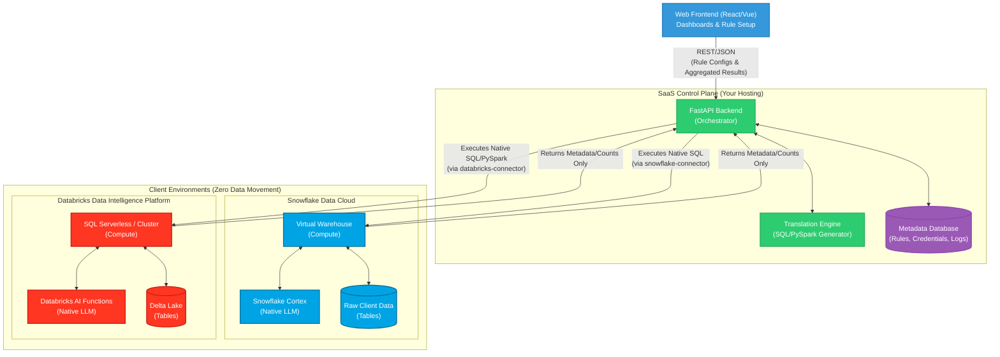

# System Architecture Diagram

This document contains the visual blueprint of our Dual-Platform Data Quality Engine. As we modify our approach or add new components, we will keep this diagram updated.

### Key Architectural Flows:
1. **Rule Creation:** User defines a rule in the **Web Frontend** (e.g., "Check email format"). The **FastAPI Backend** stores this in the **Metadata Database**.
2. **Translation:** When a job runs, the **Translation Engine** converts the abstract rule into dialect-specific code (Snowflake SQL or Databricks SQL).
3. **Pushdown Compute:** The backend sends *only* the query to the target warehouse. The client's **Compute** engine executes it against their **Raw Data**.
4. **Pushdown AI:** If the rule requires AI, the pushed-down query includes calls to **Snowflake Cortex** or **Databricks AI**.
5. **Result Retrieval:** The target warehouse returns *only* the result metrics (e.g., "15 rows failed"), guaranteeing data privacy.
